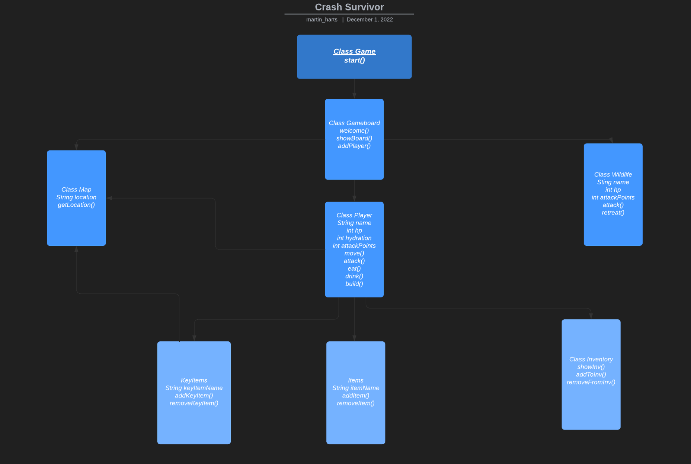

# Crash Survivor

###### **Story:**

Your plane has crashed and you are stranded in a remote jungle. All you have with you are the clothes on your back, a backpack, a water bottle, and your choice of:

Flare, flint, or pocket knife.

You have a sandwich in your backpack and a full water bottle, but you must find a way to acquire sustainment until you can reach help.

You could encounter hostile animals and dangerous situations along the way.

###### **What will be in the game:**

-Number of moves counter

-Choose from a list of characters with certain attributes: Speed, Strength

-Health/Hydration counters

-Console reset

-Ascii art

-Inventory Viewer for Backpack

-Location viewer

-Find a map, display map

-Fighting with wildlife

-Cook food or eat raw animals

-Injuries

-Cardinal direction movements

-Collect items in different locations, but make sure locations are empty if moving back to that location

-Picking up key items to move to certain locations

-Limit the amount of items in backpack

-Cross a river to civilization to win game

-Description after each move to a location

###### **Different Classes:**

-Player

-Gameboard

-Wildlife

-Game

-KeyItems Enum

-Inventory

-Map

-Items

-Location Enum

###### **UML Diagram:**

